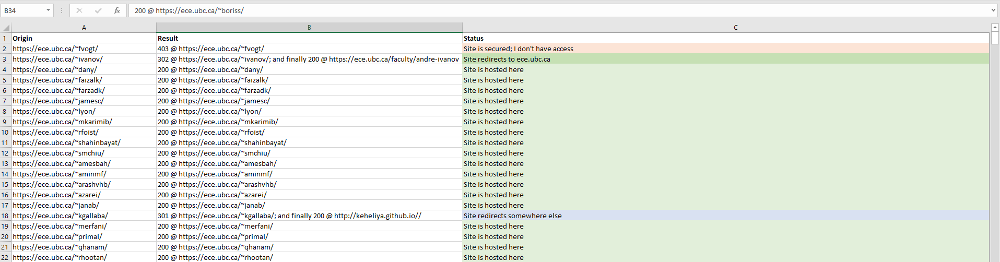

# site-tester

Another Python project to automate stuff I'm too lazy to do by hand.

[](https://www.python.org/) 

[](https://lbesson.mit-license.org/)

## Requirements

- Python
- Data, in the form a csv file

Example CSV data:

```csv
Website
https://ece.ubc.ca/~fvogt/
https://ece.ubc.ca/~ivanov/
```

Virtual environment quickstart (for Windows):

```bash
pip install virtualenv
virtualenv env
source ./env/Scripts/active
pip install -r requirements.txt
pip freeze > requirements.txt
```

## Usage

Run `python link.py -i <input file> -o <output file>`, where 'input file' is the name of a CSV file containing professor names.

### Example

Here's an example console call:

`cd ./src && python link.py -i two.csv -o test.csv`

And here's an example of the program's output (as a Markdown table):

|Origin|Result                       |Status|
|------|-----------------------------|------|
|https://ece.ubc.ca/~fvogt/|403 @ https://ece.ubc.ca/~fvogt/|Site is secured; I don't have access|
|https://ece.ubc.ca/~ivanov/|302 @ https://ece.ubc.ca/~ivanov/; and finally 200 @ https://ece.ubc.ca/faculty/andre-ivanov|Site redirects to ece.ubc.ca|
|https://ece.ubc.ca/~dany/|200 @ https://ece.ubc.ca/~dany/|Site is hosted here|
|https://ece.ubc.ca/~faizalk/|200 @ https://ece.ubc.ca/~faizalk/|Site is hosted here|
|https://ece.ubc.ca/~farzadk/|200 @ https://ece.ubc.ca/~farzadk/|Site is hosted here|
|https://ece.ubc.ca/~jamesc/|200 @ https://ece.ubc.ca/~jamesc/|Site is hosted here|
|https://ece.ubc.ca/~lyon/|200 @ https://ece.ubc.ca/~lyon/|Site is hosted here|
|https://ece.ubc.ca/~mkarimib/|200 @ https://ece.ubc.ca/~mkarimib/|Site is hosted here|
|https://ece.ubc.ca/~rfoist/|200 @ https://ece.ubc.ca/~rfoist/|Site is hosted here|

As CSV:

```csv
Origin,Result,Status
https://ece.ubc.ca/~fvogt/,403 @ https://ece.ubc.ca/~fvogt/,Site is secured; I don't have access
https://ece.ubc.ca/~ivanov/,302 @ https://ece.ubc.ca/~ivanov/; and finally 200 @ https://ece.ubc.ca/faculty/andre-ivanov,Site redirects to ece.ubc.ca
https://ece.ubc.ca/~dany/,200 @ https://ece.ubc.ca/~dany/,Site is hosted here
https://ece.ubc.ca/~faizalk/,200 @ https://ece.ubc.ca/~faizalk/,Site is hosted here
https://ece.ubc.ca/~farzadk/,200 @ https://ece.ubc.ca/~farzadk/,Site is hosted here
https://ece.ubc.ca/~jamesc/,200 @ https://ece.ubc.ca/~jamesc/,Site is hosted here
https://ece.ubc.ca/~lyon/,200 @ https://ece.ubc.ca/~lyon/,Site is hosted here
https://ece.ubc.ca/~mkarimib/,200 @ https://ece.ubc.ca/~mkarimib/,Site is hosted here
https://ece.ubc.ca/~rfoist/,200 @ https://ece.ubc.ca/~rfoist/,Site is hosted here
```

And finally, formatted in Excel:



## Future

Handle status codes better.
